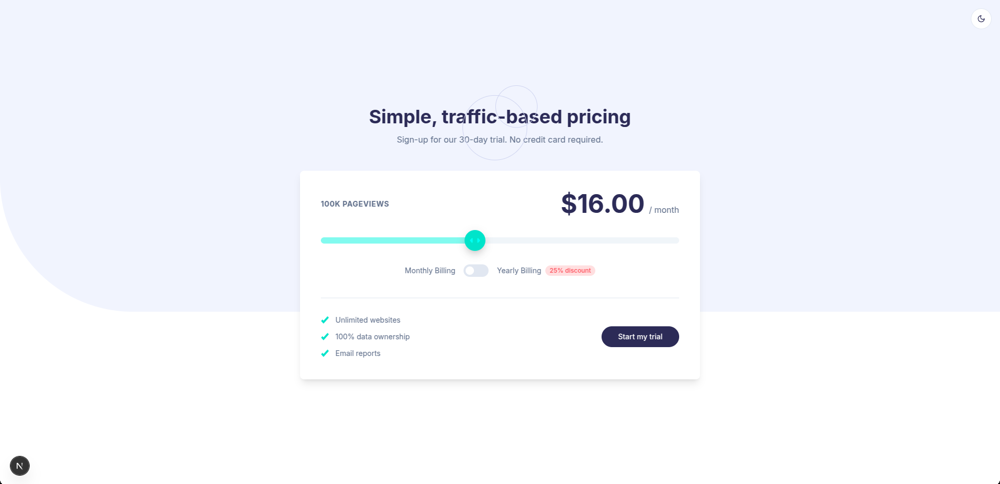
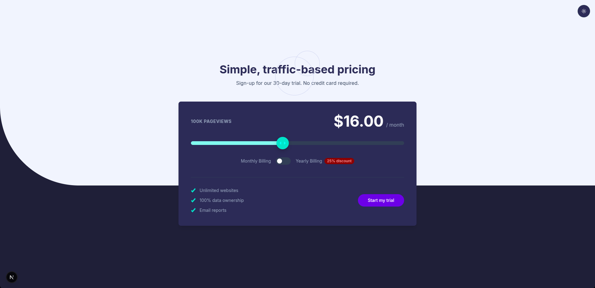

# Frontend Mentor - Interactive pricing component solution

This is a solution to the [Interactive pricing component challenge on Frontend Mentor](https://www.frontendmentor.io/challenges/interactive-pricing-component-t0m8PIyY8). Frontend Mentor challenges help you improve your coding skills by building realistic projects.

## Table of contents

- [Overview](#overview)
  - [The challenge](#the-challenge)
  - [Screenshot](#screenshot)
  - [Video](#video)
  - [Links](#links)
- [My process](#my-process)
  - [Built with](#built-with)
  - [What I learned](#what-i-learned)
  - [Continued development](#continued-development)
- [Author](#author)

## Overview

### The challenge

Users should be able to:

- View the optimal layout for the app depending on their device's screen size
- See hover states for all interactive elements on the page
- Use the slider and toggle to see prices for different page view numbers

### Screenshot

### Video

https://github.com/user-attachments/assets/40495ded-26c5-4796-8ed3-dfab96e08745

### Links

- Solution URL: [Solution URL](https://your-solution-url.com)
- Live Site URL: [Live site URL](https://investo-assignment.vercel.app/)

## My process

### Built with

- [React](https://reactjs.org/) - JS library
- [Next.js](https://nextjs.org/) - React framework
- [Tailwindcss](https://tailwindcss.com/) - For styles
- [radix-ui](https://www.radix-ui.com/)- For additional styles

## What I learned

While working on this project, I learned the following:

- **Responsive Design**: Implementing responsive layouts using Tailwind CSS and React hooks like `useIsMobile` to dynamically adjust components based on screen size.
- **Custom Slider**: Using Tailwind animations, Built a custom slider which changes values
- **Dynamic Styling**: Leveraging Tailwind's utility classes and custom CSS variables to create dynamic and theme-aware styles.

### Continued development

In future projects, I plan to focus on:

- **Improving Accessibility**: Ensuring all components are fully accessible, including proper ARIA roles and keyboard navigation.
- **Performance Optimization**: Reducing bundle size and improving load times by optimizing imports and using code-splitting techniques.
- **Advanced State Management**: Exploring state management libraries like Zustand or Redux for more complex applications.

## Author

- Website - [Akash Singu]
- Frontend Mentor - [@mildlybrutal](https://www.frontendmentor.io/profile/mildlybrutal)
- Twitter - [@keepingIt100a](https://www.x.com/keepingIt100a)

